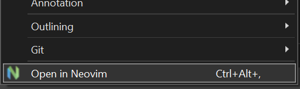
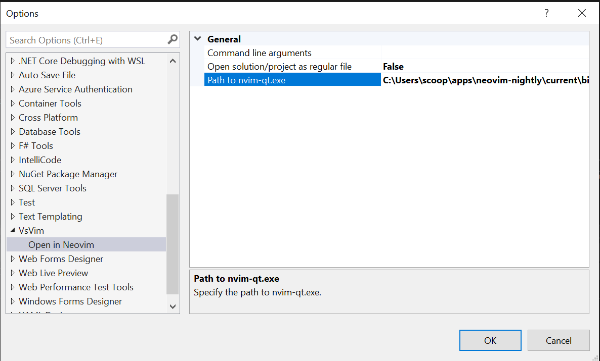

# Open In GVim

A Visual Studio extension that adds a menu command that lets you open a solution, project,
folder or file in Vim.

Download the extension at the [VS Marketplace](https://marketplace.visualstudio.com/items?itemName=HangjitRai.openingvimhrai).

---

This extension was largely patterned after Mads Kristensen's wonderful
["Open In Visual Studio Code"](https://github.com/madskristensen/OpenInVsCode) plugin.

I do use Visual Studio Code from time-to-time but I much prefer Vim. This extension is for those times when you are editing something in Visual Studio but want to be able to quickly open it in Vim.

## Prerequisite

In order to use this extension, you must have Visual Studio 2017+ as well as Gvim installed.

## Solution Explorer

You can open any solution, project, folder, or file in Vim by simply right-clicking
it in Solution Explorer and selecting **Open In GVim**.

## Path to Gvim.exe

If you installed Vim to a non-default location, a prompt will ask for the path to _Gvim.exe_.

You can always change the location in **Tools -> Options -> VsVim -> Open In GVim**.

## How to contribute?

### Sponsor

-   [Donate/Sponsor](https://github.com/sponsors/hrai) the project

### Raise issues

-   Please feel free to raise issues
-   PRs are welcome! :)
